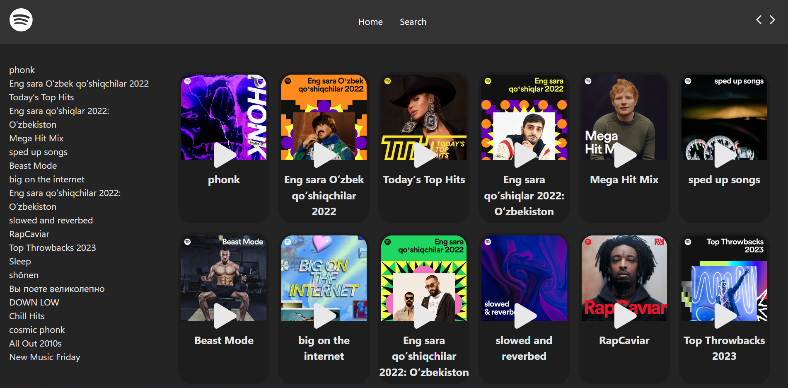
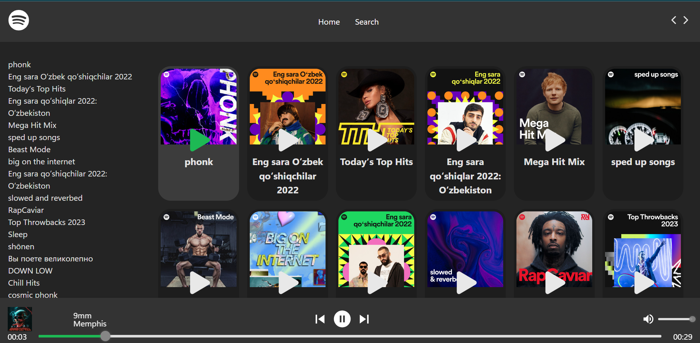
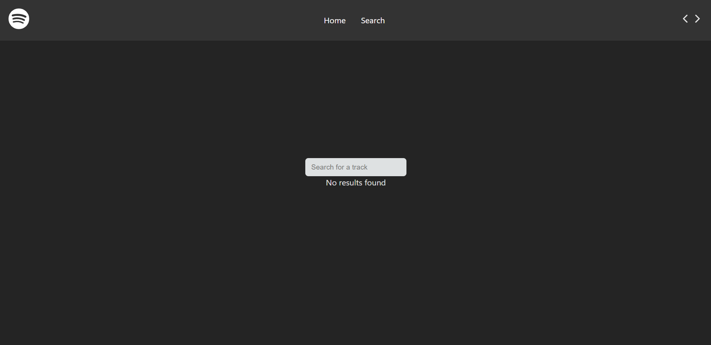
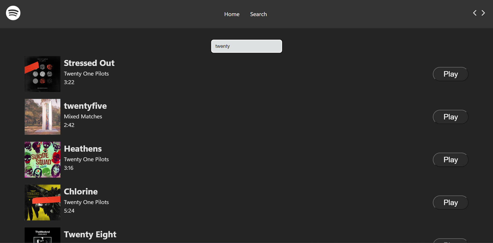

# Vite React TypeScript Spotify Task

This project is a task created using Vite, React, TypeScript, and the Spotify SDK. It features a home page and a search page.

**GitHub Repository**: [Repository Link](https://github.com/awocato/spoticato)

**Spotify SDK Integration**: This task utilizes the [Spotify Web API TypeScript SDK](https://github.com/spotify/spotify-web-api-ts-sdk).

## Important Note

Hey there! 👋 Just a quick heads-up about the project:

- The behavior may vary in certain scenarios.
- Most songs may not work due to the requirement of Spotify Premium for requesting song URIs.
- I've implemented song previews, but please note that not all songs have them.

Feel free to reach out if you have any questions or need further clarification!

## Screenshots

